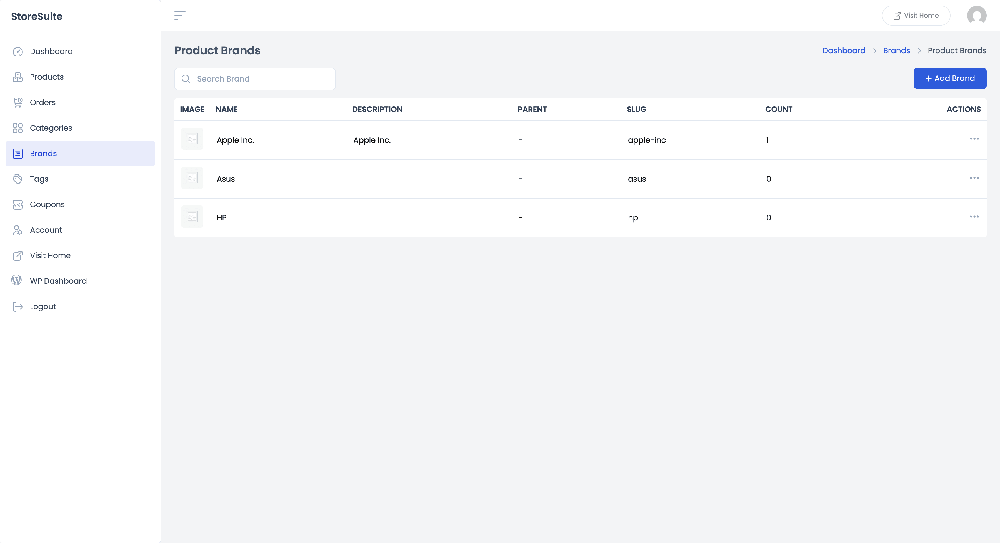
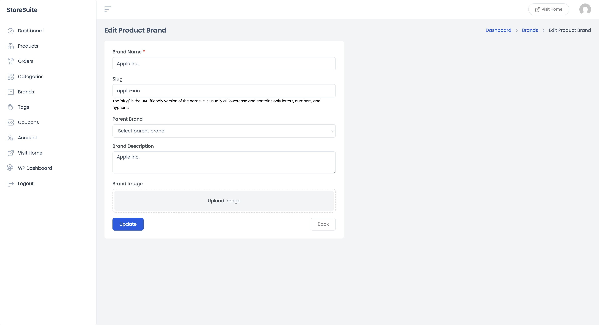

# Managing Product Brands in StoreSuite

If you sell products from multiple makers — Apple, Asus, HP, or your own house labels — brands give customers a familiar way to shop and give you a clean way to organize. StoreSuite manages them right from the frontend dashboard, no wp-admin required.

Click **Brands** in the left sidebar.

---

## The Brands List

All your brands in one tidy table:

| Column | What it tells you |
|--------|-------------------|
| **Image** | The brand's logo, if you've uploaded one |
| **Name** | The brand name |
| **Description** | The optional description |
| **Parent** | The parent brand, if this one is nested under another (or "–") |
| **Slug** | The URL-friendly version of the name |
| **Count** | How many products carry this brand |

Use the **Search Brand** box to jump straight to a brand by name — handy once your list grows past a screenful.

### Quick actions

Click the **⋯** (three dots) at the end of any row:

- **View** — opens the brand's page on your live store, showing every product under that brand.
- **Edit** — opens the editing form.
- **Delete** — removes the brand. The products stay; they just lose the brand label.

---

## Adding a New Brand

Click **+ Add Brand** and you'll get a short, friendly form — only the name is required:

- **Brand Name** *(required)* — e.g. "Apple Inc."
- **Slug** — the URL version of the name (`apple-inc`). Leave it blank to have it generated automatically; lowercase letters, numbers, and hyphens only.
- **Parent Brand** — most stores leave this empty, but if you carry sub-brands (think a parent company with several product lines), you can nest one brand under another here.
- **Brand Description** — a few words about the brand; some themes display this on the brand's page.
- **Brand Image** — click **Upload Image** to add the brand's logo. A logo wall on your shop page looks far more trustworthy than a plain text list.

Click **Submit** to create it, or **Back** to leave without saving.

Once a brand exists, you can assign it to any product from the **Brand** dropdown in the product form's General Information panel — and customers can filter the product list by brand too.

---

## Editing a Brand

Pick **Edit** from a brand's ⋯ menu and the same form opens with everything pre-filled — name, slug, description, the lot. Change what you need and click **Update**. Done.

---

## A Few Friendly Tips

- **Add logos early.** Brand images do double duty: they polish your storefront and make the dashboard list scannable at a glance.
- **Brands + filters = fast answers.** Over in **Products**, the filter panel includes *Filter by brand* — one click shows you everything from a single maker, perfect for checking stock before placing a supplier order.
- **Don't duplicate categories.** "Electronics" is a category (what the product *is*); "HP" is a brand (who *makes* it). Keep the two ideas separate and both stay useful.
- **The Count column is your supplier dashboard.** Brands with growing product counts deserve a featured spot on your homepage; brands stuck at 0 are clutter you can delete.
