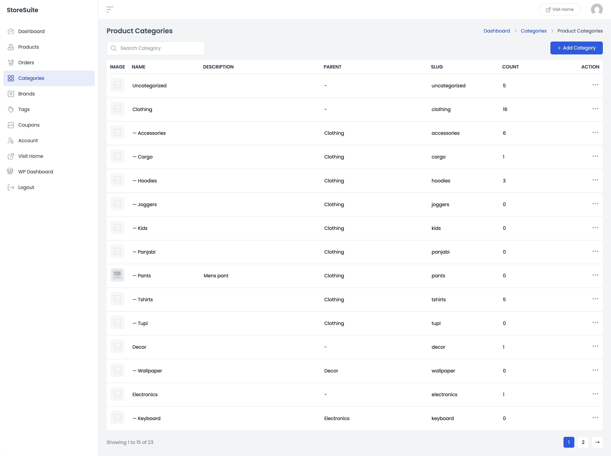
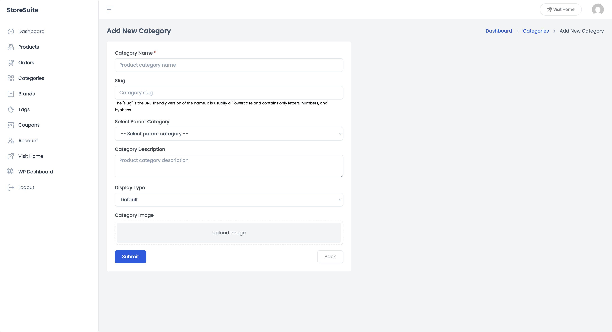
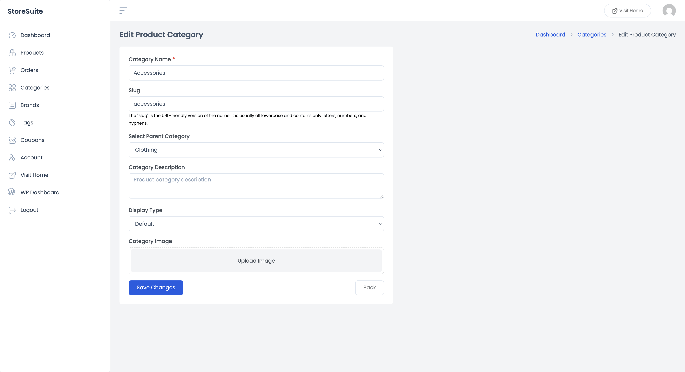

# Managing Product Categories in StoreSuite

Categories are how customers find their way around your store — Clothing, Electronics, Decor — and how *you* keep a growing catalog from turning into a junk drawer. StoreSuite lets you create, organize, and edit them right from the frontend dashboard.

Click **Categories** in the left sidebar to get started.

---

## The Categories List

Every category in your store appears here, and the layout makes the *structure* visible at a glance:

| Column | What it tells you |
|--------|-------------------|
| **Image** | The category's thumbnail, if you've set one |
| **Name** | The category name — subcategories are indented with a dash (— Accessories, — Hoodies) under their parent |
| **Description** | The optional description text |
| **Parent** | Which category this one lives under, or "–" for top-level categories |
| **Slug** | The URL-friendly version of the name |
| **Count** | How many products are in the category — a quick way to spot empty ones |

Notice how the hierarchy reads naturally: **Clothing** sits at the top level, with **Accessories**, **Cargo**, **Hoodies**, and friends tucked beneath it. One scroll and you understand your whole store structure.

The list is paginated (e.g. *"Showing 1 to 15 of 23"*), and the **Search Category** box up top finds any category by name in a keystroke.

### Quick actions

Click the **⋯** (three dots) on any row:

- **View** — opens the category's page on your live store, so you see exactly what customers see.
- **Edit** — opens the editing form.
- **Delete** — removes the category. Don't worry: deleting a category never deletes the products in it; they just lose that label.

---

## Adding a New Category

Click **+ Add Category** and fill in as much or as little as you need — only the name is required:

- **Category Name** *(required)* — what customers will see, e.g. "Hoodies".
- **Slug** — the URL version of the name (`hoodies`). Leave it blank and it's generated automatically; all lowercase, letters, numbers, and hyphens only.
- **Select Parent Category** — leave empty to create a top-level category, or pick a parent to nest it. This is how "Clothing → Hoodies" structures are born.
- **Category Description** — optional text that some themes display on the category page.
- **Display Type** — controls what the category's page shows on your storefront:
  - **Default** — whatever your theme decides
  - **Products** — just the products
  - **Subcategories** — just the child categories (nice for big top-level categories like "Clothing")
  - **Both** — subcategories first, then products
- **Category Image** — click **Upload Image** to give the category a visual. Many themes show these on shop pages, so it's worth the few seconds.

Hit **Submit** and the category is live. **Back** returns you to the list without saving.

---

## Editing a Category

Choose **Edit** from any category's ⋯ menu and you'll get the same form, pre-filled with the category's current details — here you can rename it, move it under a different parent, change the display type, or swap the image.

Make your changes and click **Save Changes**. That's it.

---

## A Few Friendly Tips

- **Keep the hierarchy shallow.** One or two levels (Clothing → Hoodies) is easy to browse; four levels deep is a maze. If you're nesting that far, you probably want tags instead.
- **Watch the Count column.** Categories with 0 products either need products or need deleting — empty categories on a live store look abandoned.
- **Use parent categories as "shelves," not destinations.** Set big parents like Clothing to display *Subcategories*, so customers drill down instead of scrolling hundreds of products.
- **Slugs matter for URLs.** They appear in your store's web addresses, so keep them short and readable — you can edit one anytime, but changing it after launch changes the URL.
