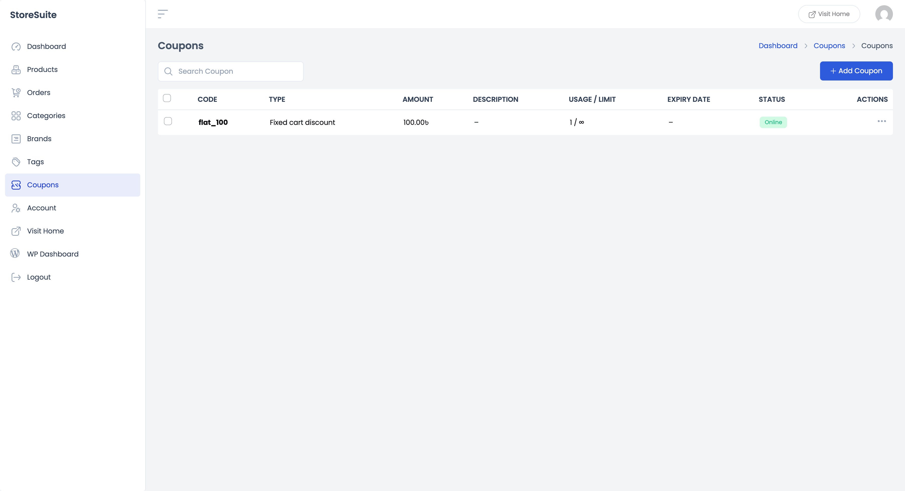
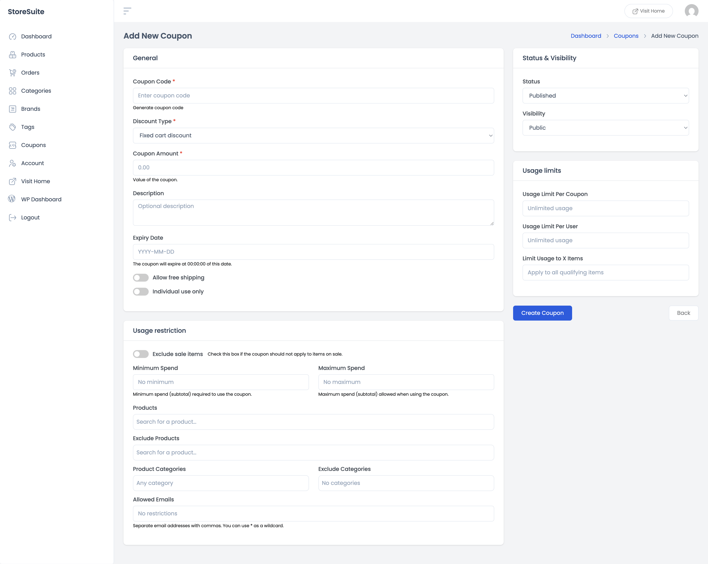
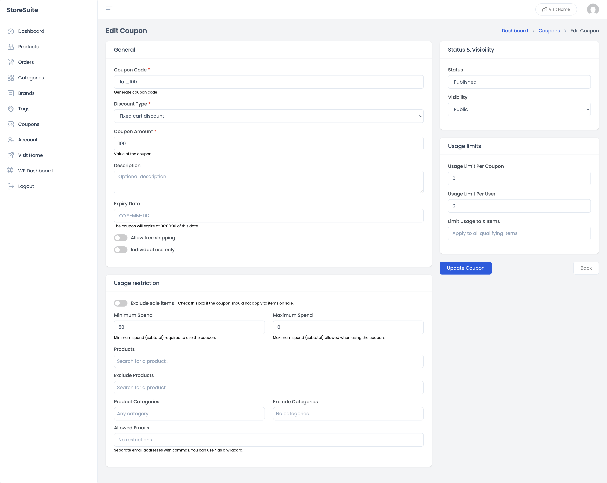

# Managing Coupons in StoreSuite

A good coupon can rescue an abandoned cart, reward a loyal customer, or kick off a sale weekend. StoreSuite lets you create and manage all of them from the frontend dashboard — from a simple "10% off everything" to a tightly targeted "free shipping for this one customer on orders over 50".

Click **Coupons** in the left sidebar to get started.

---

## The Coupons List

Every coupon in your store, summed up in one row each:

| Column | What it tells you |
|--------|-------------------|
| **Code** | The code customers type at checkout (e.g. `flat_100`) |
| **Type** | What kind of discount it gives — percentage, fixed cart, or fixed product |
| **Amount** | The discount value |
| **Description** | Your internal note about what the coupon is for |
| **Usage / Limit** | How many times it's been used versus its limit — `1 / ∞` means used once, unlimited uses allowed |
| **Expiry Date** | When the coupon stops working, or "–" if it never expires |
| **Status** | A green **Online** badge means it's live and redeemable |

The **Search Coupon** box finds any code instantly.

### Quick actions

Click the **⋯** (three dots) on any row:

- **Edit** — open the coupon for changes.
- **Delete** — retire it for good.

---

## Creating a Coupon

Click **+ Add Coupon**. The form is organized into four cards — but don't let that intimidate you: for a basic coupon you only need the top three fields. Everything else is optional fine-tuning.

### General — the essentials

- **Coupon Code** *(required)* — what customers will type at checkout. Keep it short and memorable (`SUMMER20`). Stuck for ideas? Click **Generate coupon code** and StoreSuite invents one for you.
- **Discount Type** *(required)* — the three classics:
  - **Percentage discount** — e.g. 20% off the cart
  - **Fixed cart discount** — e.g. 100 off the whole order
  - **Fixed product discount** — e.g. 100 off each qualifying product
- **Coupon Amount** *(required)* — the number: `20` for 20%, or `100` for a flat 100.
- **Description** — a private note for your own reference ("Spring newsletter promo"). Customers never see it.
- **Expiry Date** — pick a date and the coupon switches itself off at 00:00:00 that day. No midnight logins required.
- **Allow free shipping** — flip this on and the coupon unlocks free shipping (your free-shipping method must be set up to require a coupon).
- **Individual use only** — when on, this coupon refuses to be combined with any other coupon. Your stack-proofing switch.

### Usage restriction — who and what qualifies

This card is where a generic discount becomes a *targeted* one:

- **Exclude sale items** — stop the coupon from double-dipping on products that are already discounted.
- **Minimum Spend / Maximum Spend** — require a cart subtotal of at least X (great for "save 10 on orders over 50") or cap it at most Y.
- **Products / Exclude Products** — limit the coupon to specific products, or shield specific products from it. Start typing and pick from the list.
- **Product Categories / Exclude Categories** — same idea, but for whole categories ("20% off everything in Clothing").
- **Allowed Emails** — restrict the coupon to specific customer emails. Separate several with commas, and use `*` as a wildcard — `*@company.com` covers a whole team. Perfect for VIP or apology coupons.

### Usage limits — how many times

- **Usage Limit Per Coupon** — total number of redemptions before the coupon retires itself. Leave blank for unlimited.
- **Usage Limit Per User** — how many times one customer can use it. Set it to `1` for one-per-customer offers.
- **Limit Usage to X Items** — cap how many cart items the discount applies to.

### Status & Visibility

- **Status** — **Published** makes it live; save as **Draft** while you're still deciding the details.
- **Visibility** — **Public** or **Private**.

When everything's set, click **Create Coupon**. It's redeemable immediately.

---

## Editing a Coupon

Choose **Edit** from a coupon's ⋯ menu and the same form opens with every value filled in — code, amount, restrictions, limits, all of it. Adjust what you need and click **Update Coupon**.

A common mid-campaign move: a promo is performing *too* well, so you open it up and add a usage limit or a minimum spend — without changing the code everyone already has.

---

## A Few Friendly Tips

- **Always set an expiry date.** A coupon that "we'll disable later" is a coupon someone redeems two years from now. Let the expiry field do the remembering.
- **"Individual use only" is your safety net.** Without it, customers can stack coupons in ways you didn't budget for. Turn it on unless you *specifically* want stacking.
- **Minimum spend protects your margins.** "100 off" hurts on a 110 order; "100 off orders over 500" drives bigger carts instead.
- **Watch the Usage / Limit column.** It's live campaign feedback — a coupon at `0 / ∞` a week into the promo tells you the campaign needs help, not the coupon.
- **Apply coupons to manual orders too.** When creating an order by hand in **Orders**, the *Discounts & Fees* card has an **Apply Coupon** button — same codes, same rules.
