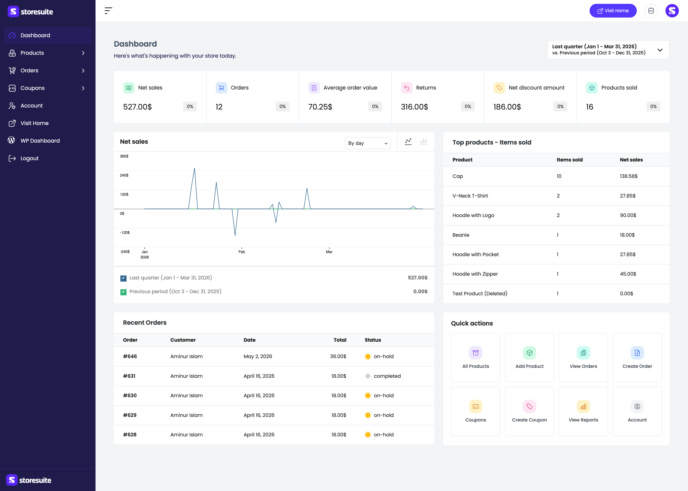
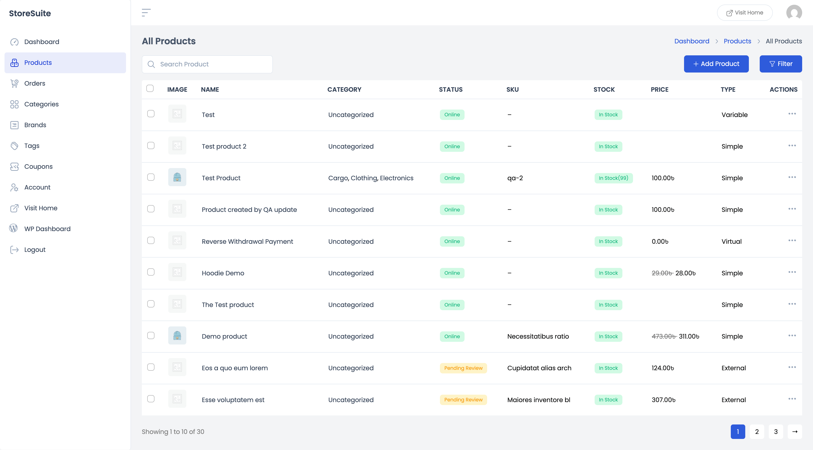
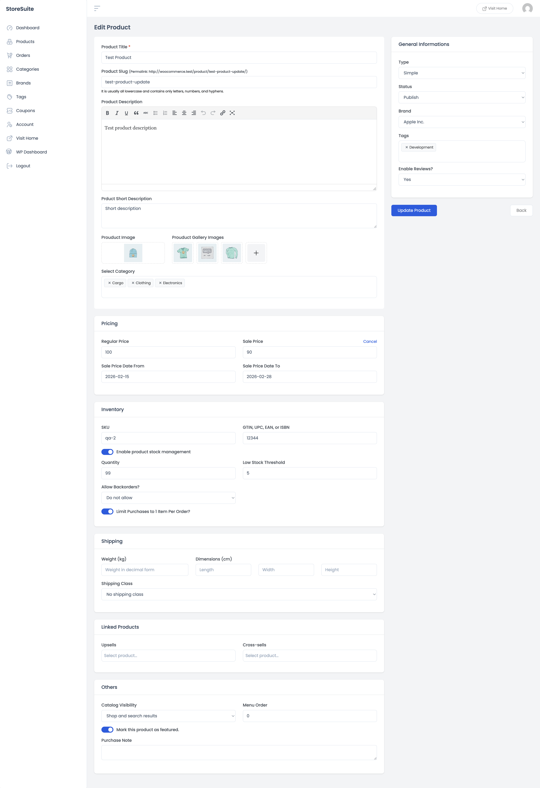
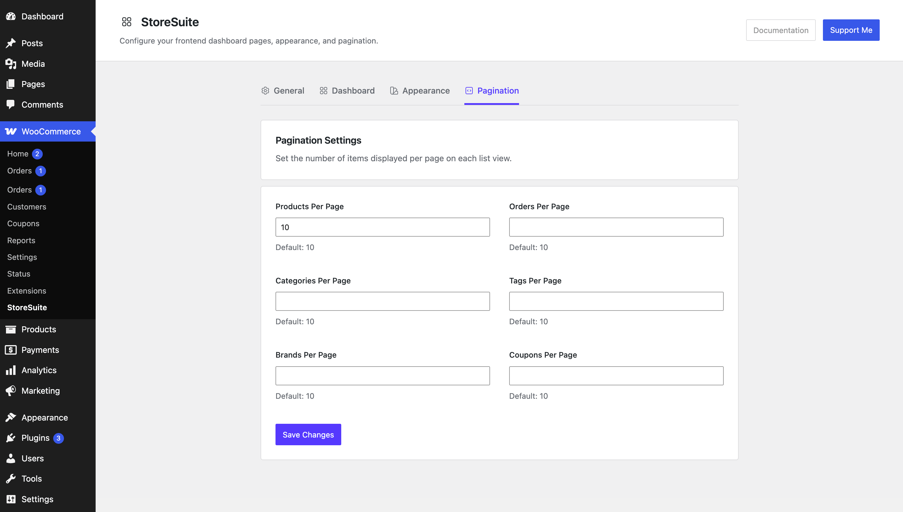
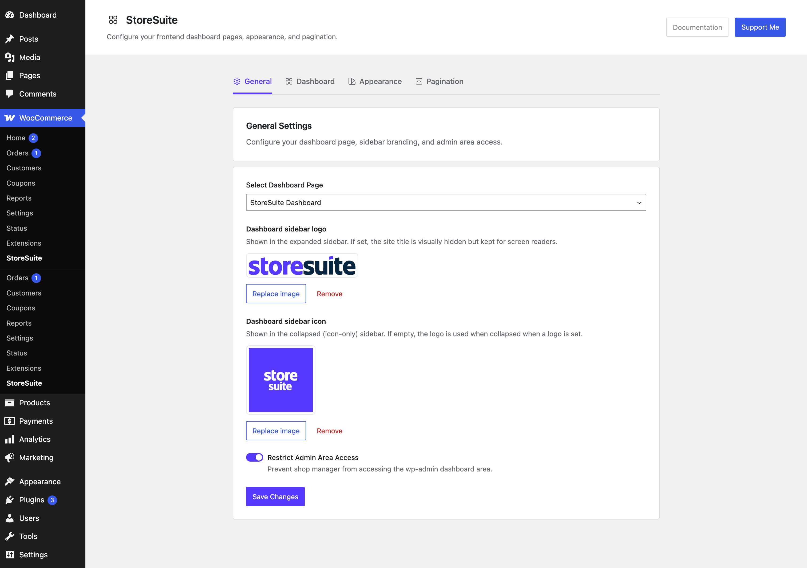

# Manage Your WooCommerce Shop Completely From the Frontend Using StoreSuite

Have you ever wished you could run your WooCommerce store without ever logging into the WordPress admin?

If you've handed your store over to a shop manager — or you're the owner who just wants to add a product and check today's sales without wading through menus, plugins, and settings you don't need — the standard WooCommerce admin can feel like a lot. Too many screens. Too much clutter. Too many places a non-technical team member can accidentally break something.

That's exactly the problem **StoreSuite** sets out to solve. It gives you a clean, modern **frontend dashboard** where you (and your team) can manage everything — products, orders, coupons, categories, and analytics — from one place. No `wp-admin`. No clutter. Just your store.

And here's the part most people don't expect: StoreSuite ships features for **free** that other store-management dashboards usually lock behind a Pro plan — including **AI content and image generation**, full **variable product** support, **real-time analytics**, and **CSV export**.

Let's walk through it.

---

## What Is StoreSuite?

StoreSuite is a WordPress plugin that adds a **frontend store-management dashboard** to your WooCommerce shop. Instead of giving your team access to the WordPress backend, you give them a single page on your own site where they can do everything day-to-day:

- Add and edit products (every type — simple, variable, grouped, external)
- View, create, and edit orders
- Build and manage coupons
- Organize categories, tags, brands, and attributes
- Watch real-time sales numbers and leaderboards
- Generate product titles, descriptions, and images with AI

It requires WooCommerce, it's fully compatible with **WooCommerce HPOS** (High-Performance Order Storage), and access is gated by the `manage_woocommerce` capability — so only administrators and shop managers get in.

---

## Why Manage Your Store From the Frontend?

A quick honest list of why this matters:

- **Less risk.** Your shop manager never sees plugin settings, theme files, or anything they could break. They see your store — nothing else.
- **Less clutter.** No third-party plugin notices, no unrelated admin menus. StoreSuite even strips out theme and conflicting plugin styles on its own pages so the dashboard stays clean and fast.
- **Faster work.** Everything is one or two clicks away. Add a product, check an order, spin up a coupon — without hunting through the backend.
- **A nicer experience.** It's a modern, responsive interface that works on desktop, tablet, and mobile.

Now let's look at what you can actually do.

---

## 1. A Dashboard That Shows Your Store at a Glance

Log in, land on the dashboard, and within a few seconds you know how your store is doing. That's the whole idea.

The dashboard home greets you with your store's pulse — a row of **performance boxes** showing the numbers that matter: net sales, orders, average order value, returns, discounts, and products sold. Each box carries a small **percentage badge** so you can see how today compares to yesterday (or this month vs. last month, or this December vs. last December — your choice).

Below that sits a **net-sales chart** you can switch between line and bar views and group by day, week, or month. Then come the **leaderboards** — top products, top categories, top customers, top coupons — and a **Recent Orders** table so you can spot anything that needs attention.

Finally, a **Quick Actions** grid gives you one-click shortcuts to the things you do most: add a product, view orders, create a coupon, and more.

> **Tip:** Running a promotion? Set the date range to your promo week and compare against the previous period — the percentage badges instantly tell you whether it moved the needle.

---

## 2. Complete Product Management

This is where most store owners spend their time, and StoreSuite makes it effortless.

The **Products** list is your home base. Every product appears in a clean table with its image, name, category, status, SKU, a color-coded **stock badge**, price (with the old price crossed out on sale items), and type. From here you can:

- **Search** any product by name instantly
- **Filter** by category, product type, stock status, or brand — and combine them (for example, *out-of-stock products in the Clothing category*)
- **Quick edit** the basics (name, price, stock, status) right from the list
- Use **bulk actions** to edit, trash, or export many products at once

### Add or edit any product type

StoreSuite handles every WooCommerce product type — **simple, variable, grouped, and external/affiliate**. The add/edit form walks you through everything top to bottom, but only the title is truly required, so you can start simple and polish later.

You get full control over pricing (including **scheduled sales** that turn themselves on and off), inventory with low-stock thresholds and backorders, shipping, upsells and cross-sells, catalog visibility, and more.

**Variable products** get special love: manage attributes and variations, run bulk actions, and use **generate-all-variations** to create every size/color combination in one click — something many "free" dashboards simply don't offer.

---

## 3. AI That Writes and Designs For You

Here's StoreSuite's standout feature — and it's completely free.

Writing product descriptions is the part most store owners dread. StoreSuite hands it to AI:

- **Per-field generation** — a "Generate with AI" button on the product **title**, **short description**, and **long description**. Each one opens an editable suggestion you can tweak, **regenerate**, or step through previous suggestions with a **history pager**.
- **All-in-one generator** — type a single hint and StoreSuite drafts the title, short description, and long description together.
- **AI image generation** — describe a featured or gallery image, preview it, regenerate, and drop it straight into your media library.

You stay in control with a dedicated **AI settings page**, where you can turn generation on or off per field and set your own custom instructions for each text field and for images.

StoreSuite uses a **"bring your own AI"** approach — it's built on the WordPress 7.0 core AI connector, so generation runs on the provider and keys *you* configure. (If your site is on an older WordPress version, the AI features simply hide themselves.)

---

## 4. Full Order Management

Orders are front and center. From the **Orders** section you can:

- View every order with its number, customer, date, total, and a color-coded **status badge**
- Open any order to see full customer and line-item details
- **Create a new order** by hand — perfect for phone or in-person sales
- **Edit** existing orders when something needs changing

Because StoreSuite is **HPOS-compatible**, it works smoothly even on high-volume stores using WooCommerce's modern order storage.

---

## 5. Coupons, Categories, Tags, Brands & Attributes

Everything that keeps your catalog organized is here too.

- **Coupons** — create, edit, and manage WooCommerce discount codes with all the usual rules.
- **Categories, Tags, and Brands** — add, edit, and list them without leaving the dashboard. The lists even refresh instantly if changes are made elsewhere (admin, REST API, an import).
- **Product Attributes** — manage attributes and their terms, ready to power your variable products.

To keep the sidebar tidy, Categories, Brands, and Tags are neatly nested under the **Products** menu.

---

## 6. Export Your Products to CSV

Need your catalog for reporting, accounting, or migrating to another store? StoreSuite includes **CSV product export** with a configurable export modal — select what you need and download it. Again, free, no upsell.

---

## 7. Make It Your Own

From **WooCommerce → StoreSuite** in your WordPress admin, you can shape the dashboard to fit your brand and workflow:

- **Branding** — add a sidebar logo (expanded) and a sidebar icon (collapsed) from the media library.
- **Color palettes** — choose a predefined palette or build a custom one with live preview.
- **Dashboard widgets** — switch performance boxes and leaderboards on or off; show eight meaningful numbers instead of fifteen noisy ones.
- **Pagination** — control how many items show per page on each list.

There's also a collapsible sidebar that toggles between a full menu and a slim icon-only rail, with your preference remembered in the browser.

---

## How to Get Started

Setting up StoreSuite takes about two minutes:

1. **Install and activate WooCommerce** (if you haven't already).
2. **Install and activate StoreSuite** from **Plugins → Add New** (search "StoreSuite").
3. On activation, StoreSuite automatically creates a dashboard page with the `[storesuite_dashboard]` shortcode and selects it for you. If it didn't, create a page, add the shortcode, and publish.
4. Go to **WooCommerce → StoreSuite → General** and confirm your dashboard page is selected, then **Save Changes**.
5. Visit that page while logged in with store-management permissions — and you're managing your store from the frontend.

> If a dashboard URL ever returns a 404, just go to **Settings → Permalinks** and click **Save Changes** to refresh the routes.

---

## Final Thoughts

Running a WooCommerce store shouldn't mean living inside the WordPress admin. **StoreSuite** gives you and your team a clean, fast, frontend home for everything that matters — products, orders, coupons, your whole catalog, and real-time analytics — plus AI that writes your descriptions and creates your images.

And it does all of it with **no feature gates, no trial limits, and no upsell**. The premium-grade tools other dashboards charge for are simply included.

If you've been looking for the easiest way to manage your WooCommerce shop completely from the frontend, give StoreSuite a try — your morning store check-in is about to get a whole lot shorter.

**[Get StoreSuite free from the WordPress plugin directory →](https://wordpress.org/plugins/storesuite/)**
