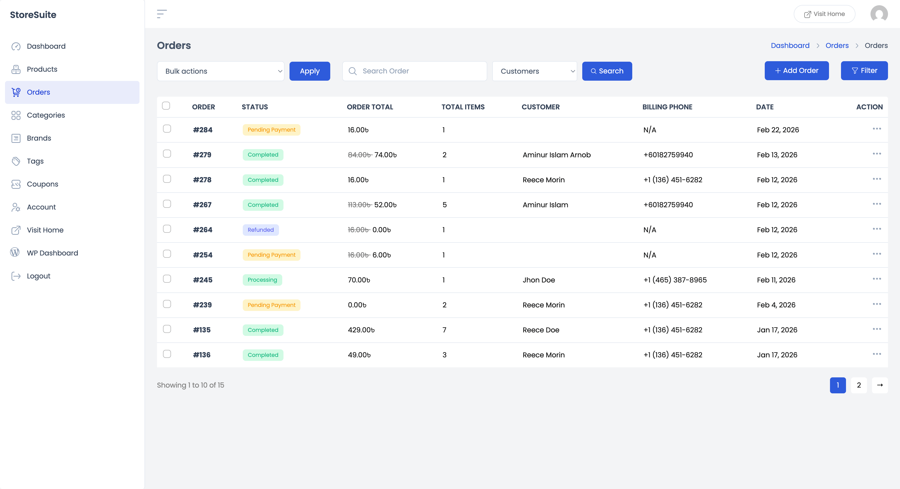
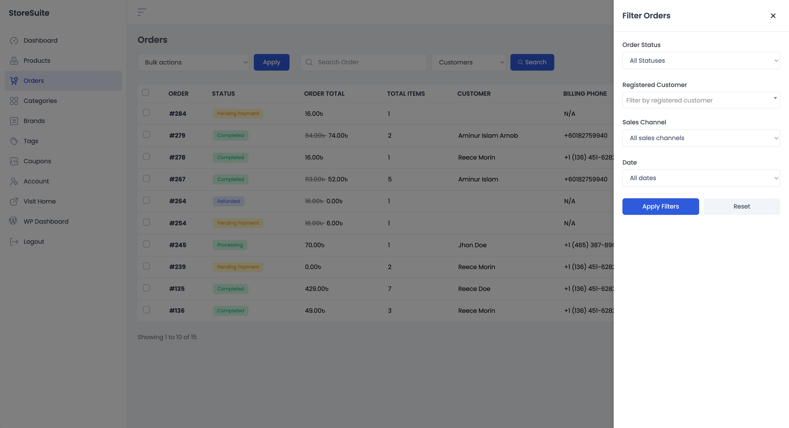
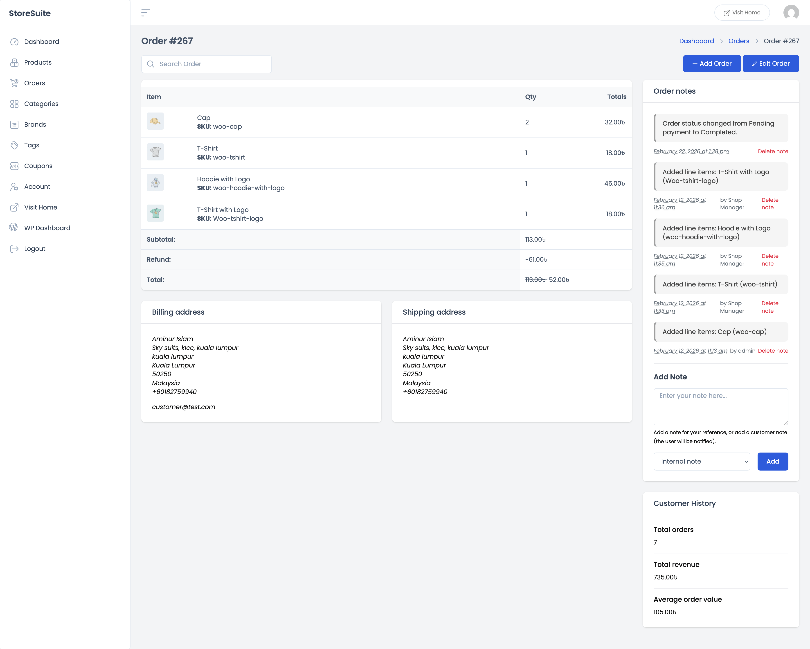
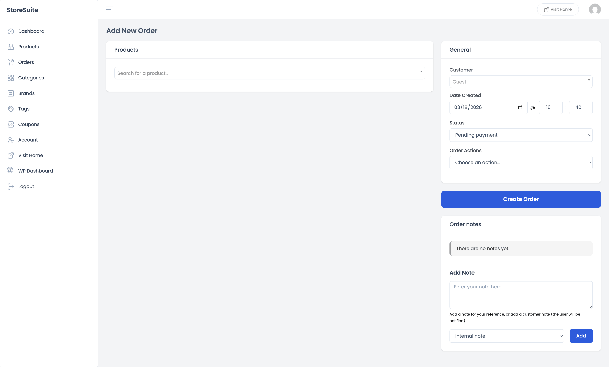
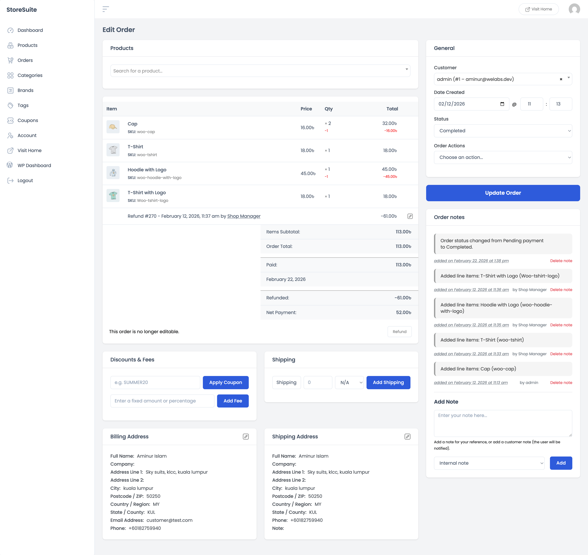

# Managing Orders in StoreSuite

Orders are the heartbeat of your store, and StoreSuite puts all of them in one place — right in your frontend dashboard. You can review new orders, update statuses, issue refunds, add notes, and even create orders by hand (perfect for phone or in-person sales) without ever opening the WordPress admin.

To get started, click **Orders** in the left sidebar.

---

## The Orders List

This is where every order in your store lines up, newest first. Each row gives you the full picture in a single glance:

| Column | What it tells you |
|--------|-------------------|
| **Order** | The order number — click it to open the order |
| **Status** | A colored badge: green for **Completed** or **Processing**, yellow for **Pending Payment**, and so on |
| **Order Total** | What the order is worth — if a refund was issued, you'll see the original amount crossed out next to the new total |
| **Total Items** | How many items the customer bought |
| **Customer** | Who placed the order (guest orders show without a name) |
| **Billing Phone** | The customer's phone number, or *N/A* if none was given |
| **Date** | When the order came in |

At the bottom you'll see your total order count (e.g. *"Showing 1 to 10 of 15"*) with page numbers to browse through history.

### Searching for an order

The search bar at the top is smarter than it looks. Next to it there's a dropdown that lets you choose *what* to search by:

- **Order ID** — when the customer gives you their order number.
- **Customer Email** — find every order from one email address.
- **Customers** — search by customer name.
- **Products** — find all orders that contain a certain product.
- **All** — search everything at once.

Type your term, pick a scope, and hit **Search**. StoreSuite even remembers your preferred search scope for next time.

### Quick actions on any order

Click the **⋯** (three dots) at the end of a row:

- **View** — opens the read-only order details page.
- **Edit** — opens the full order editor.

### Updating many orders at once

Restocking day, shipping day, end-of-month cleanup — sometimes you need to move a whole batch of orders forward. Tick the checkboxes next to the orders, then pick from **Bulk actions**:

- **Change status to processing**
- **Change status to on-hold**
- **Change status to completed**
- **Change status to cancelled**
- **Move to Trash**

Click **Apply**, and they're all updated in one go.

---

## Filtering Orders

Click the **Filter** button and a panel slides in from the right with four ways to narrow your view:

- **Order Status** — show only Pending Payment, Processing, Completed, Refunded, and so on.
- **Registered Customer** — start typing a customer's name and pick them from the list to see only their orders.
- **Sales Channel** — where the order came from (your website, manually created, etc.).
- **Date** — limit the list to a specific month.

Mix and match as you like — for example, *all Pending Payment orders from March*. Click **Apply Filters** to see the results, or **Reset** to clear everything and start fresh.

---

## Viewing an Order

Click **View** on any order (or click its number) and you get a clean, read-only summary of everything about that sale:

### What was bought

The top card lists every item — photo, name, SKU, quantity, and line total — followed by the **Subtotal**, any **Refund**, applied **Coupons**, and the final **Total**. If a partial refund was issued, you'll see the original total crossed out beside the adjusted one, so the math is never a mystery.

### Where it's going

Side-by-side **Billing address** and **Shipping address** cards show the customer's full details, including email and phone — everything you need to print a label or make a quick call.

### Order notes — the order's diary

On the right, the **Order notes** panel keeps a running history of everything that happened: status changes, items added, refunds — each entry stamped with the date, time, and who did it. It's your audit trail, built automatically.

You can also add your own notes:

- **Internal note** — visible only to you and your team. Great for things like *"Customer called, ship after Friday."*
- **Note to customer** — the customer gets notified by email. Useful for delivery updates or thank-you messages.

Type your note, pick the type, click **Add**. Any note can be removed later with **Delete note**.

### Customer History

Below the notes you'll find a small but mighty panel showing this customer's lifetime stats:

- **Total orders** — how many times they've bought from you.
- **Total revenue** — how much they've spent overall.
- **Average order value** — their typical purchase size.

One glance tells you if you're talking to a first-timer or one of your best customers — which can change how you handle a request entirely.

Need to change something? Hit **Edit Order** at the top right.

---

## Creating an Order Manually

Took an order over the phone? Selling at a market stall? Click **+ Add Order** from the orders list and build the order yourself.

1. **Add products** — start typing in the *Search for a product…* box, pick the items, set quantities, and click **Add To Order**.
2. **Pick the customer** — in the **General** panel on the right, search for a registered customer or leave it as **Guest**.
3. **Set the date** — orders default to right now, but you can backdate them if you're logging an older sale.
4. **Choose a status** — usually **Pending payment** for unpaid orders or **Processing** if payment is already in hand.
5. Click **Create Order**. Done.

You can add notes immediately too — handy for recording *how* the order came in ("phone order, will pick up Saturday").

---

## Editing an Order

The order editor is the full workbench. Here's what you can do:

### Change products and amounts

While an order is still unpaid, you can add or remove items and adjust quantities directly in the items table. Once an order has been paid, the items lock to protect the record — you'll see *"This order is no longer editable"* — but you can still refund, change the status, edit addresses, and add notes.

### Issue refunds

Click **Refund** to give back part or all of the payment. The order keeps a clear money trail: **Items Subtotal**, **Order Total**, **Paid** (with the payment date), **Refunded**, and the final **Net Payment**. Each refund is also logged in the order notes automatically.

### Discounts & Fees

- **Apply Coupon** — type a coupon code and apply it to the order, just like the customer would at checkout.
- **Add Fee** — add a fixed amount or percentage fee (rush handling, gift wrapping, you name it).

### Shipping

Add a shipping line to the order: give it a name, choose one of your store's shipping methods (or "Other"), set the cost, and click **Add Shipping**.

### Billing & Shipping addresses

Click the edit (pencil) icon on either address card to change any detail — name, company, address, country, phone. The billing card also holds the **Payment Method** and **Transaction ID**, and the shipping card includes the **Customer Provided Note** if the buyer left one at checkout.

### General panel

On the right you can:

- **Reassign the customer** — link the order to a different registered customer or set it to Guest.
- **Change the date created.**
- **Update the status** — Pending payment, Processing, On hold, Completed, Cancelled, Refunded, Failed.
- **Run Order Actions** — one-click extras:
  - **Send order details to customer** — emails the customer a full copy of their order.
  - **Resend new order notification** — sends the "new order" email to the store admin again.
  - **Regenerate download permissions** — refreshes download access for digital products.

When you're done, click **Update Order** to save everything at once.

---

## A Few Friendly Tips

- **Use bulk status changes on shipping day.** Select everything you just shipped, mark them Completed, hit Apply — done in seconds.
- **Lean on order notes.** A 10-second internal note today saves a 10-minute memory hunt next month — and "Note to customer" doubles as a built-in update email.
- **Check Customer History before making judgment calls.** A refund request from a customer with 20 orders is a different conversation than one from a brand-new guest.
- **Search by product** when a supplier issue hits — instantly find every order containing the affected item.
- **Creating an order for a phone sale?** Set the status to Pending payment and use *Send order details to customer* — they'll get an email with everything, and can pay from there.
