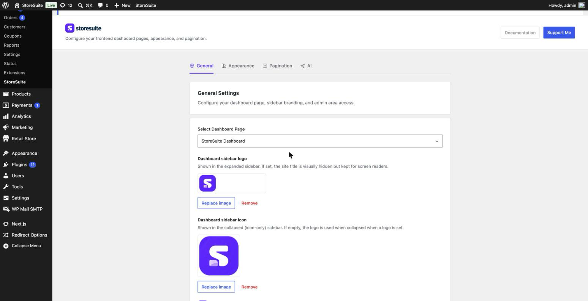
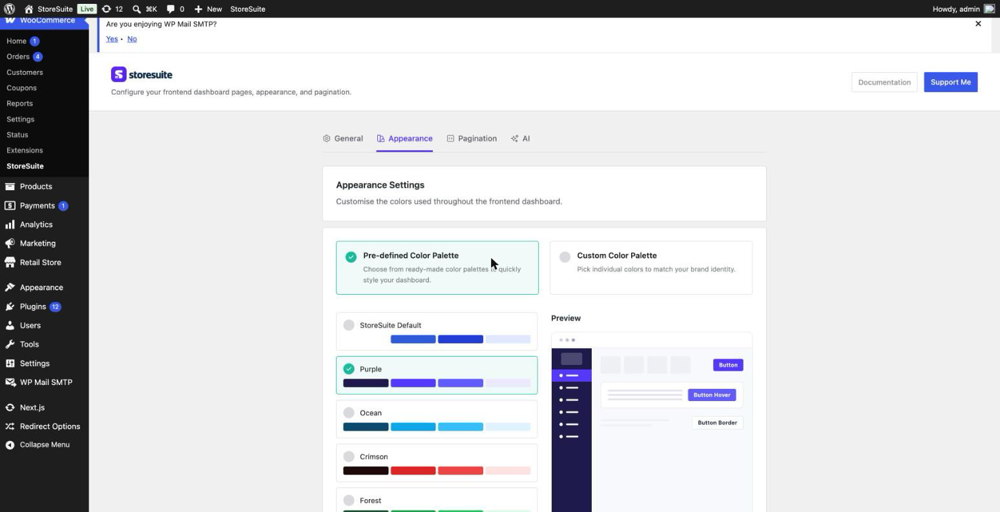
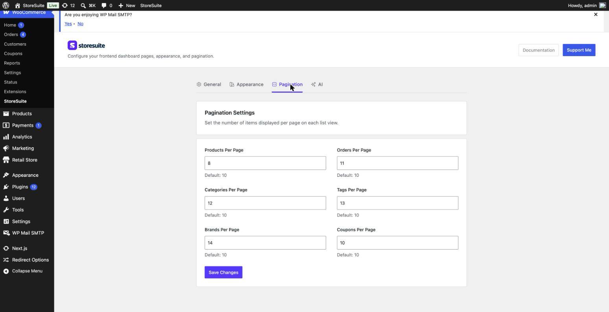
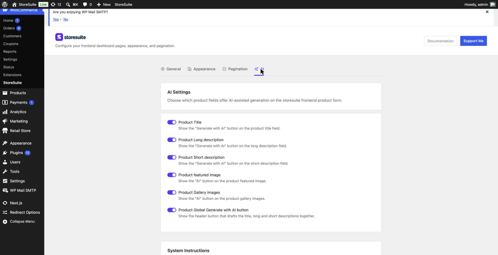
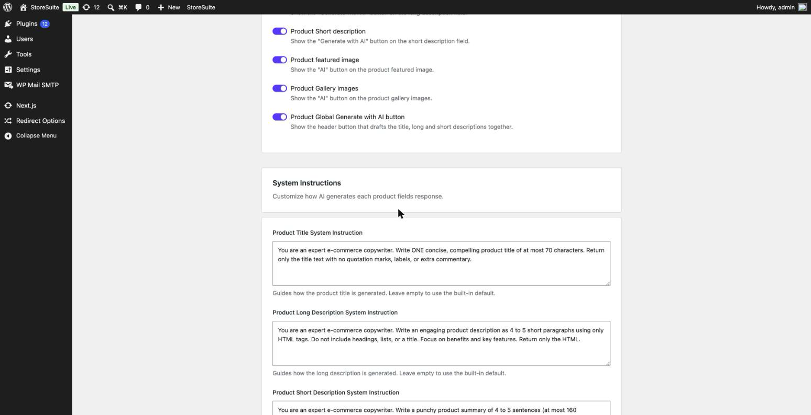

# StoreSuite Settings (Admin)

While your team works in the frontend dashboard, *you* control how that dashboard looks and behaves from one tidy settings page in the WordPress admin.

To find it, log in to WordPress and go to **WooCommerce → StoreSuite**. Everything is organized into four tabs along the top: **General**, **Appearance**, **Pagination**, and **AI**.

> Up in the top-right corner you'll also find a **Documentation** button (which brings you to guides like this one) and a **Support Me** button if StoreSuite is making your life easier and you'd like to say thanks.

---

## General — the foundations

This is where you set up the basics: which page hosts the dashboard, what branding it carries, and who's allowed into the WordPress admin.

### Select Dashboard Page

StoreSuite creates a dashboard page for you automatically when you activate the plugin, but if you ever want the dashboard to live somewhere else, pick any page here. The chosen page becomes the home of the entire frontend dashboard — products, orders, and all.

### Dashboard sidebar logo

Upload your own logo and it appears at the top of the dashboard sidebar, replacing the plain site title. Your team (or your client) sees *their* brand, not the plugin's. The site title stays in place behind the scenes for screen readers, so accessibility doesn't suffer. Use **Replace image** to swap it or **Remove** to go back to the text title.

### Dashboard sidebar icon

The dashboard sidebar can collapse down to a slim, icon-only strip. This square icon is what shows in that collapsed state — think of it as your logo's compact cousin. If you leave it empty, StoreSuite reuses the main logo when the sidebar is collapsed.

### Restrict Admin Area Access

Toggle this on to **prevent shop managers from reaching the wp-admin dashboard**. They get the clean StoreSuite frontend and nothing else — no plugin settings, no theme files, nothing they could accidentally break. This is the setting that makes StoreSuite a safe hand-off for non-technical staff.

Click **Save Changes** when you're done with this tab.

---

## Appearance — make it yours

Customize the colors used throughout the frontend dashboard. There are two ways to go:

- **Pre-defined Color Palette** — choose from ready-made palettes (StoreSuite Default, Purple, Ocean, Crimson, Forest, and more) to restyle the whole dashboard in one click.
- **Custom Color Palette** — pick individual colors to match your exact brand identity.

A live **Preview** panel on the right shows a mini version of the dashboard — buttons, sidebar, hover states — updating as you choose, so you can see the result before you save.

> **Tip:** Start from the pre-defined palette that's closest to your brand, then switch to **Custom** to fine-tune just the couple of colors that need it. Faster than building a palette from scratch.

---

## Pagination — how much shows per page

Set how many items appear on each list before it breaks into pages. There's a separate control for each area:

- **Products Per Page**
- **Orders Per Page**
- **Categories Per Page**
- **Tags Per Page**
- **Brands Per Page**
- **Coupons Per Page**

Each defaults to **10**. Turn it up if your team prefers scrolling over clicking through pages, or down to keep lists light and fast on slower connections.

---

## AI — assisted content generation

StoreSuite can help draft product content right on the frontend product form. This tab decides **where** those AI helpers appear and **how** they write.

### Which fields offer AI

Toggle the **Generate with AI** helper on or off for each part of the product form:

- **Product Title**
- **Product Long description**
- **Product Short description**
- **Product featured image**
- **Product Gallery images**
- **Product Global Generate with AI button** — the header button that drafts the title and both descriptions together in one go.

Turn off any you'd rather your team write themselves.

### System Instructions — steering the AI

Each field has a **System Instruction** — a short brief that tells the AI how to write for that field. StoreSuite ships sensible defaults (for example, the product title brief asks for "ONE concise, compelling product title of at most 70 characters"), and you can rewrite any of them to match your store's voice:

- **Product Title System Instruction**
- **Product Long Description System Instruction**
- **Product Short Description System Instruction**
- **Product Image System Instruction** — styling guidance appended to every AI image prompt.

Leave a box empty to fall back to the built-in default. Click **Save Changes** to apply.

> **Tip:** Bake your brand voice into these instructions once — "friendly, no jargon, mention the material" — and every product your team generates comes out sounding like you, with no extra editing.

---

## A Few Friendly Tips

- **Each tab saves on its own.** Click **Save Changes** before switching tabs so you don't lose edits.
- **Restrict admin access is the safety net.** If you're handing the store to a shop manager, turn it on so they stay in the clean StoreSuite view.
- **Match pagination to your workflow.** Fulfilling lots of orders at once? Bump **Orders Per Page** up so you page through less.
