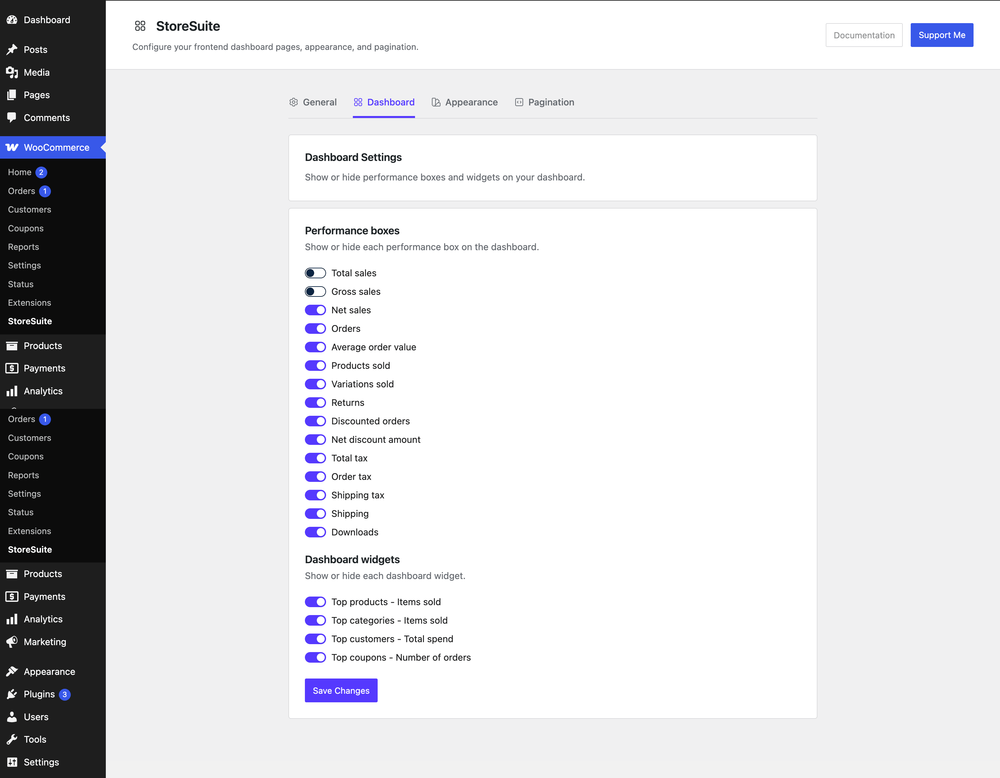
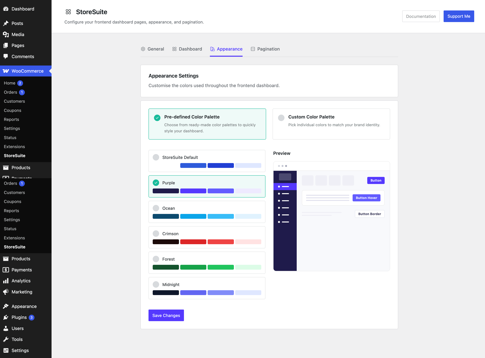

# StoreSuite Plugin Settings

While your team works in the frontend dashboard, *you* control how that dashboard looks and behaves from one tidy settings page in the WordPress admin.

To find it, log in to WordPress and go to **WooCommerce → StoreSuite**. Everything is organized into four tabs along the top: **General**, **Dashboard**, **Appearance**, and **Pagination**. Each tab has its own **Save Changes** button, so save before hopping to the next one.

> Up in the corner you'll also find a **Documentation** button (you're reading the result!) and a **Support Me** button if StoreSuite is making your life easier and you'd like to say thanks.

---

## General — the foundations

This is where you set up the basics: which page hosts the dashboard, what branding it carries, and who's allowed into the WordPress admin.

### Select Dashboard Page

StoreSuite creates a dashboard page for you automatically when you activate the plugin, but if you ever want the dashboard to live somewhere else, pick any page here. The chosen page becomes the home of the entire frontend dashboard — products, orders, and all.

### Dashboard sidebar logo

Upload your own logo and it appears at the top of the dashboard sidebar, replacing the plain site title. Your team (or your client) sees *their* brand, not the plugin's. The site title stays in place behind the scenes for screen readers, so accessibility doesn't suffer.

Use **Replace image** to swap it or **Remove** to go back to the text title.

### Dashboard sidebar icon

The dashboard sidebar can collapse down to a slim, icon-only strip. This square icon is what shows in that collapsed state — think of it as your logo's compact cousin. If you leave it empty, StoreSuite simply reuses the main logo when the sidebar is collapsed.

### Restrict Admin Area Access

This toggle is the heart of StoreSuite's philosophy. Switch it on, and **shop managers can no longer reach the wp-admin area at all** — they're guided to the frontend dashboard instead, where everything they need is waiting. No accidental visits to plugin settings, no overwhelming admin menus. Just their store.

Leave it off if you'd rather shop managers keep both doors open.

Click **Save Changes** and you're done.

---

## Dashboard — choose what your team sees

The dashboard home page greets your team with performance numbers and "top" lists. This tab lets you decide exactly which of those appear. Maybe you don't charge tax, or you don't sell downloads — switch those boxes off and the dashboard stays clean and relevant.

### Performance boxes

Each toggle shows or hides one stat box on the dashboard home:

- **Total sales** / **Gross sales** / **Net sales** — your revenue, sliced three ways
- **Orders** — how many orders came in
- **Average order value** — what a typical order is worth
- **Products sold** / **Variations sold** — units moved
- **Returns** — refunded value
- **Discounted orders** / **Net discount amount** — how much your coupons are being used, and what they cost you
- **Total tax** / **Order tax** / **Shipping tax** — tax breakdowns
- **Shipping** — shipping charges collected
- **Downloads** — digital file downloads

### Dashboard widgets

These are the leaderboard-style lists below the stats:

- **Top products – Items sold** — your best sellers
- **Top categories – Items sold** — which sections of the store perform best
- **Top customers – Total spend** — your VIPs
- **Top coupons – Number of orders** — which promo codes actually get used

Flip off anything you don't need, hit **Save Changes**, and the frontend dashboard updates instantly.

---

## Appearance — make it yours

Out of the box the dashboard wears StoreSuite's colors. This tab lets it wear yours instead. There are two ways to go about it:

### Pre-defined Color Palette

The quick route. Pick from seven ready-made palettes, each shown with a strip of its colors:

- **StoreSuite Default** — the classic blue
- **Purple**
- **Ocean** — cool blues
- **Crimson** — bold reds
- **Forest** — fresh greens
- **Midnight** — dark and dramatic
- **Graphite** — understated grays

As you click through them, the **Preview** panel on the right shows a miniature mock-up of the dashboard — sidebar, buttons, hover states — so you can see the vibe before committing.

### Custom Color Palette

The hands-on route, for matching an exact brand identity. Switch to this mode and you get individual color pickers for every part of the dashboard, including:

- **Buttons** — text, background, and their hover states
- **Text** — normal text, titles, and lighter helper text
- **Icons**
- **Sidebar** — menu text, background, active/hover menu colors, and borders
- **General borders and light background tones**

You can also choose which version of your logo fits best — a **dark logo** for light sidebar backgrounds or a **light logo** for dark ones — so your branding never disappears into the background.

Tweak, watch the preview, and **Save Changes** when it feels right. The entire frontend dashboard recolors itself immediately.

---

## Pagination — set your page sizes

Short and sweet: this tab controls how many items show per page in each list view of the frontend dashboard.

There's a field for each list:

- **Products per page**
- **Orders per page**
- **Categories per page**
- **Tags per page**
- **Brands per page**
- **Coupons per page**

Every field defaults to **10**. Leave a field blank to keep the default, or type your own number — if your team prefers scrolling one long page over clicking through five short ones, bump products up to 50 and call it a day.

**Save Changes**, and the new page sizes apply across the dashboard.

---

## A Few Friendly Tips

- **Setting up for a client?** Upload their logo, pick a palette that matches their brand, and turn on *Restrict Admin Area Access* — they get a polished, branded store manager that never shows them the WordPress admin.
- **Less is more on the dashboard.** Hide every stat that doesn't apply to your store. A dashboard with eight meaningful numbers beats one with fifteen noisy ones.
- **Test the preview before saving.** The Appearance preview reflects your choices live — a ten-second look there saves a save-and-refresh round trip.
- **Tune pagination to your catalog.** Small store? Set products to 50 and skip pagination entirely. Thousands of products? Keep it at 10–20 so pages stay fast.
