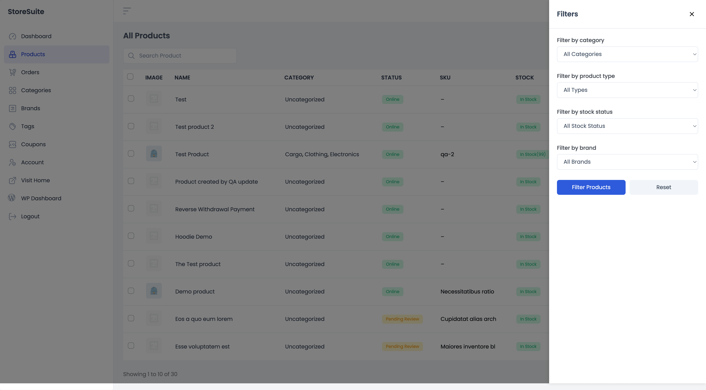
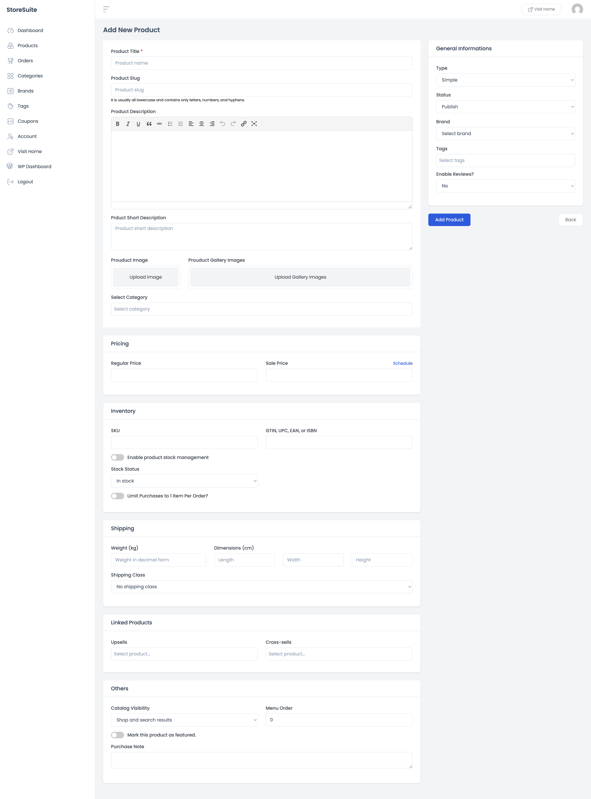

# Managing Products in StoreSuite

Everything you need to sell — adding products, updating prices, tracking stock — lives in the **Products** section of your StoreSuite dashboard. No WordPress admin, no clutter. Just your products, in one clean view.

To get there, click **Products** in the left sidebar.

---

## The Products List

This is your home base. Every product in your store appears here in a simple table, and each row tells you the essentials at a glance:

| Column | What it tells you |
|--------|-------------------|
| **Image** | The product's main photo (a placeholder shows if you haven't added one yet) |
| **Name** | The product title — click it to jump straight into editing |
| **Category** | Which categories the product belongs to |
| **Status** | Whether it's **Online** (live on your store), a draft, or **Pending Review** |
| **SKU** | Your stock-keeping unit, if you've set one |
| **Stock** | A colored badge — green for **In Stock** (with the quantity, if you track it), red for **Out of Stock**, yellow for **On Backorder** |
| **Price** | The current price — if the product is on sale, you'll see the old price crossed out next to the new one |
| **Type** | Simple, Variable, Virtual, External, and so on |

At the bottom you'll see how many products you have in total (for example, *"Showing 1 to 10 of 30"*) along with page numbers to move through your catalog.

### Finding a product fast

Type a product name into the **Search Product** box at the top and press Enter. The list narrows down to matching products instantly.

### Quick actions on any product

Hover over the **⋯** (three dots) at the right end of any row to open a small menu:

- **View** — opens the product page on your live store in a new tab, so you can see exactly what customers see.
- **Edit** — opens the full editing screen.
- **Quick edit** — change the basics (name, price, stock, status) right from the list without leaving the page.
- **Delete** — moves the product to trash.

### Doing things in bulk

Need to update many products at once? Tick the checkboxes on the left side of the rows you want, then choose an action from the **Bulk actions** dropdown above the table:

- **Edit** — change shared details across all selected products in one go.
- **Move to Trash** — remove several products at once.
- **Export** — download the selected products as a file.

Pick your action and click **Apply**.

---

## Filtering Your Products

When your catalog grows, scrolling isn't fun anymore. Click the **Filter** button at the top right and a panel slides in from the side with four ways to narrow things down:

- **Filter by category** — show only products from a specific category (each option shows the product count, so you know what to expect).
- **Filter by product type** — only Simple products, only Variable, and so on.
- **Filter by stock status** — quickly find everything that's out of stock or on backorder. Great for restock day.
- **Filter by brand** — show products from a single brand.

You can combine filters — for example, *out-of-stock products in the Clothing category*. Once you've made your picks, click **Filter Products**. To go back to seeing everything, hit **Reset**.

> **Tip:** Filters work together with search, so you can search for a name *and* filter by category at the same time.

---

## Adding a New Product

Click the **+ Add Product** button at the top of the products list. You'll land on a clean form that walks you through everything, top to bottom. Only one field is truly required — the title — so you can start simple and fill in the rest as you go.

### The basics

- **Product Title** *(required)* — the name customers will see.
- **Product Slug** — the web address for the product (e.g. `blue-cotton-hoodie`). Leave it blank and it's created automatically from the title.
- **Product Description** — the full story of your product. The editor gives you bold, italics, lists, links, and more — just like writing a document.
- **Product Short Description** — a quick summary that usually appears next to the product photo.
- **Product Image** — the main photo. Click **Upload Image** to pick one from your computer or media library.
- **Product Gallery Images** — extra photos customers can flip through.
- **Select Category** — put the product in one or more categories so customers can find it.

### Pricing

- **Regular Price** — the everyday price.
- **Sale Price** — a discounted price. Click **Schedule** to set start and end dates, and the sale will turn itself on and off automatically.

### Inventory

- **SKU** — your internal product code, if you use one.
- **GTIN, UPC, EAN, or ISBN** — the product's barcode number, if it has one.
- **Enable product stock management** — flip this on and StoreSuite counts your stock for you. You can set the quantity, a **low stock threshold** (so you get warned before running out), and decide whether to **allow backorders** when stock hits zero.
- **Stock Status** — if you'd rather not count units, just mark the product In Stock or Out of Stock manually.
- **Limit Purchases to 1 Item Per Order** — handy for limited editions or one-per-customer offers.

### Shipping

- **Weight** and **Dimensions** — used to calculate shipping costs at checkout.
- **Shipping Class** — group products that ship the same way (e.g. "bulky items").

### Linked Products

- **Upsells** — products you'd recommend *instead* of this one (usually a nicer, pricier option). Shown on the product page.
- **Cross-sells** — products that go *with* this one. Shown in the cart — think "would you like batteries with that?"

### Others

- **Catalog Visibility** — control where the product shows up: shop and search, shop only, search only, or hidden entirely.
- **Menu Order** — a number for custom sorting (lower numbers appear first).
- **Mark this product as featured** — highlight it in featured-product sections of your theme.
- **Purchase Note** — a short message sent to the customer after they buy (great for download instructions or thank-you notes).

### General Information (right-hand panel)

The panel on the right handles the product's identity:

- **Type** — Simple is the everyday choice. Pick **Variable** for products with options like size or color, **External** for products sold on another site, or **Grouped** to bundle related products.
- **Status** — **Publish** to go live right away, or save as a draft to finish later.
- **Brand** — assign the product to one of your brands.
- **Tags** — add keywords to help with search and organization.
- **Enable Reviews** — choose whether customers can leave reviews on this product.

When everything looks good, hit **Add Product**. Done — it's in your store.

---

## Editing an Existing Product

Click any product's name in the list (or choose **Edit** from its ⋯ menu) to open the editing screen. It's the exact same layout as the add screen, so there's nothing new to learn — every field arrives pre-filled with the product's current details.

A few things you'll notice on this screen:

- The **permalink** (the product's web address) is shown under the title, so you always know where the product lives.
- If the product is on sale with scheduled dates, you'll see the **Sale Price Date From / To** fields filled in — change or cancel them anytime.
- With stock management on, the current **Quantity** and **Low Stock Threshold** are right there to adjust after a restock.

Make your changes and click **Update Product** to save. Changed your mind? **Back** returns you to the list without saving anything.

---

## A Few Friendly Tips

- **Start minimal.** A title, a price, and a photo are enough to get a product live. You can always come back and polish the description later.
- **Use Quick Edit for small fixes.** Changing a price or stock number? Quick edit from the list saves you a full page load.
- **Let scheduled sales do the work.** Set the sale dates once and forget about it — no midnight logins to flip prices.
- **Watch the stock badges.** A quick scroll down the Stock column (or a filter on stock status) is the fastest restock checklist you'll ever have.
