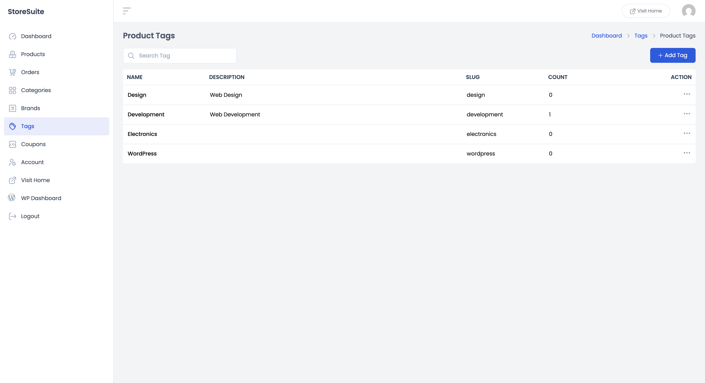
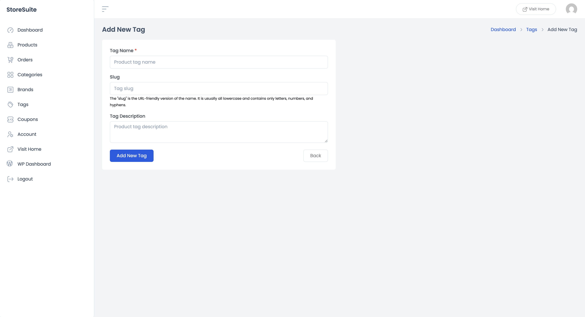
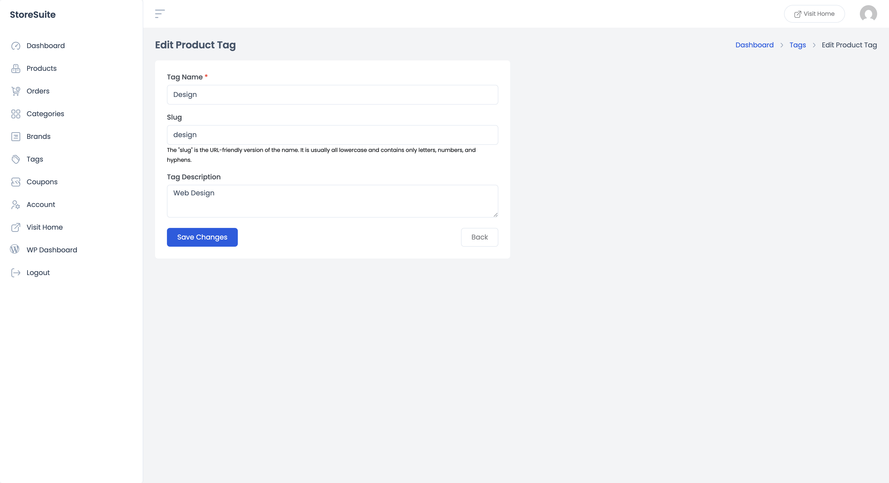

# Managing Product Tags in StoreSuite

Tags are the loose, flexible labels of your store. Where categories are the shelves ("Clothing"), tags are the sticky notes — *summer*, *organic*, *gift idea*, *new arrival*. A product sits in one or two categories but can wear as many tags as you like, and customers can use them to discover related products across your whole catalog.

Click **Tags** in the left sidebar to manage them.

---

## The Tags List

A clean table of every tag in your store:

| Column | What it tells you |
|--------|-------------------|
| **Name** | The tag itself |
| **Description** | Optional descriptive text |
| **Slug** | The URL-friendly version of the name |
| **Count** | How many products carry this tag |

Tags are deliberately simple — no images, no hierarchy, no parents. That's their superpower: zero structure to maintain.

The **Search Tag** box at the top finds any tag instantly, and the list paginates once it grows long.

### Quick actions

Click the **⋯** (three dots) on any row:

- **View** — opens the tag's archive page on your live store, listing every product with that tag.
- **Edit** — opens the editing form.
- **Delete** — removes the tag. Products keep right on existing; they just shed the label.

---

## Adding a New Tag

Click **+ Add Tag**. The form is the shortest one in StoreSuite:

- **Tag Name** *(required)* — keep it short and natural: "summer", "bestseller", "eco-friendly".
- **Slug** — the URL version (`summer`). Leave blank and it's created automatically — all lowercase, letters, numbers, and hyphens.
- **Tag Description** — optional; some themes show it on the tag's archive page.

Click **Submit** and the tag is ready to use. You can now attach it to any product from the **Tags** field in the product form's General Information panel.

> **Tip:** You don't *have* to come here to create tags — typing a new tag directly on a product creates it on the fly. This page is where you come to tidy up afterwards.

---

## Editing a Tag

Choose **Edit** from a tag's ⋯ menu, and the same little form opens pre-filled. Rename it, adjust the slug, update the description — then click **Save Changes**.

Renaming a tag updates it everywhere at once, which makes this the fastest way to fix a typo that snuck onto twenty products.

---

## A Few Friendly Tips

- **Tags cut across categories.** "Gift idea" can live on a hoodie, a mug, and a pair of headphones at once — that's a connection categories can't make.
- **Prune regularly.** Tags multiply quietly ("summer", "Summer", "summer-2025"…). Check the Count column now and then; tags used on one product or none are usually merge-or-delete candidates.
- **Agree on a style.** Lowercase, singular, simple — whatever convention you pick, write it down. Consistent tags are useful tags.
- **Don't over-tag.** Three to five meaningful tags per product beat fifteen vague ones — both for customers browsing and for keeping this list manageable.
